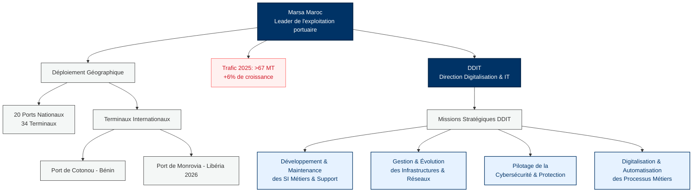
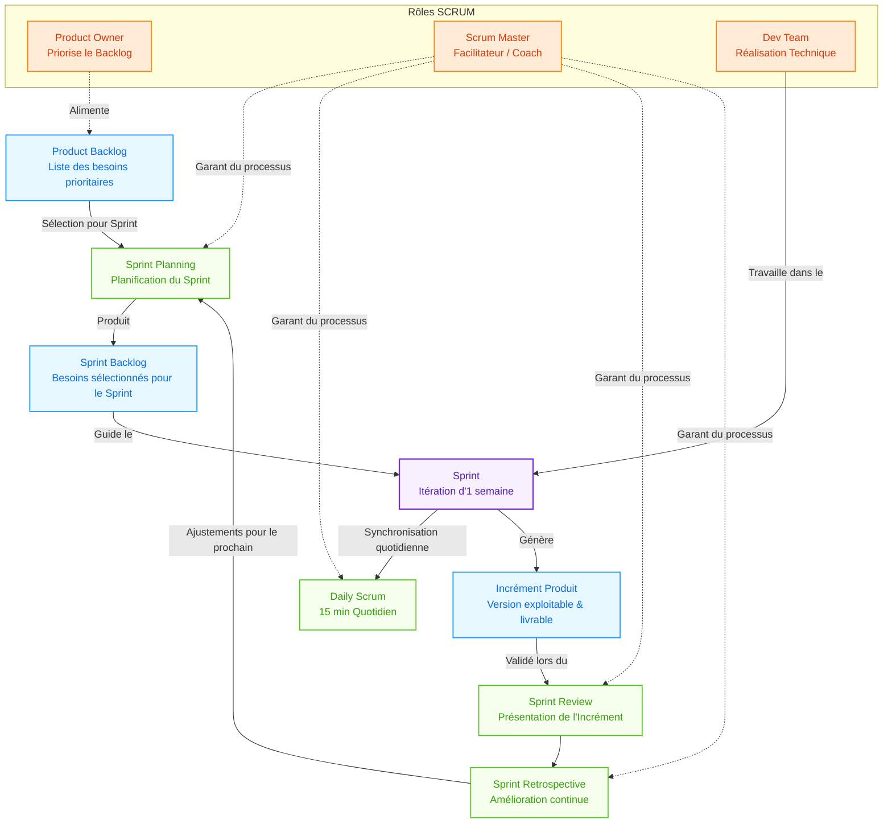
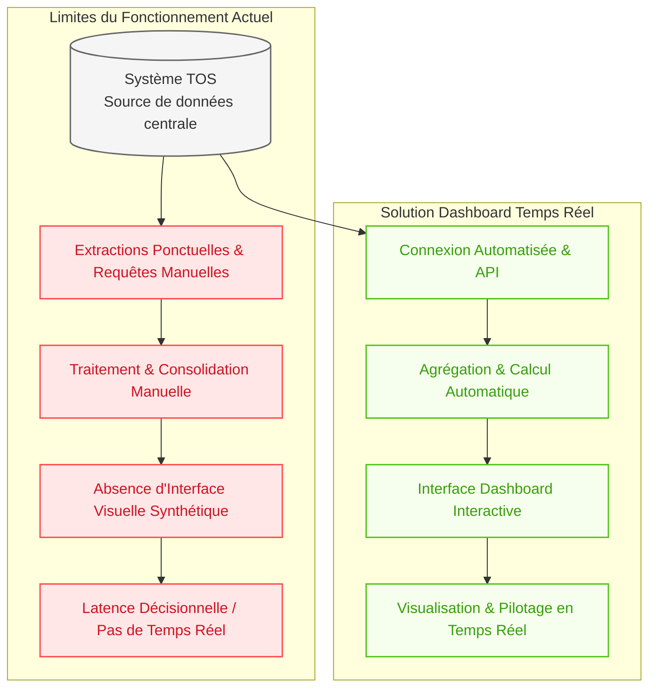
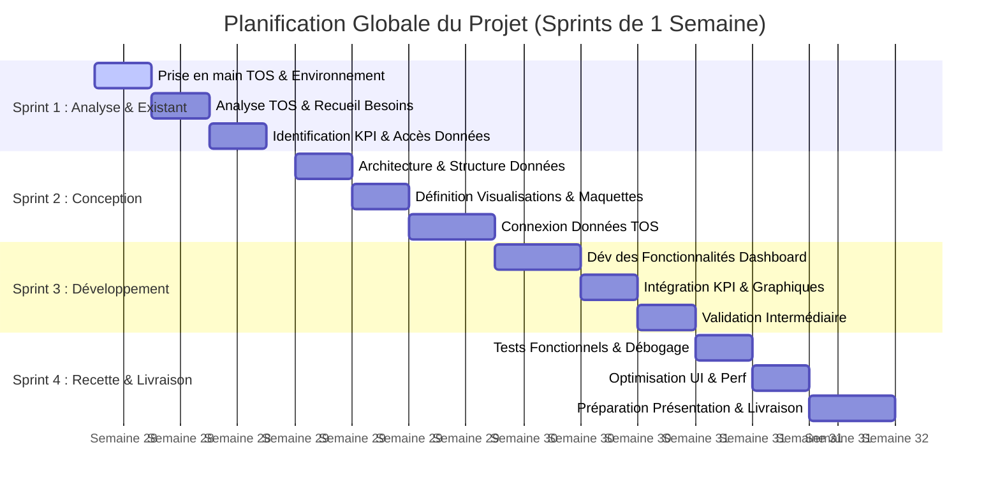

# SYSTEM DASHBOARDING TOS — MARSA MAROC

Ce document présente une version enrichie du **System Dashboarding TOS** de Marsa Maroc, intégrant des schémas, graphes et diagrammes interactifs pour faciliter la compréhension des enjeux, de la méthodologie, de l'architecture technique et de la planification.

---

## 1. Contexte & Enjeux (Marsa Maroc & DDIT)

### 1.1 — Présentation de Marsa Maroc
Née en **2007** de la scission de l'ancien Office d'Exploitation des Ports (ODEP) dans le cadre de la réforme portuaire de 2006, **Marsa Maroc** s'est imposée comme le leader de l'exploitation portuaire au Royaume. 

L'entreprise gère un vaste réseau :
* **Déploiement national** : Présence dans l'ensemble des ports de commerce du pays, avec **34 terminaux** répartis sur **20 ports**.
* **Trafic 2025** : Plus de **67 millions de tonnes** de marchandises traitées (+6 % par rapport à 2024).
* **Diversification des activités** : Conteneurs, vracs solides et liquides, hydrocarbures, roulier, véhicules neufs.
* **Expansion internationale** : Gestion du terminal du port de **Cotonou (Bénin)** et signature en **2026** d'un accord pour la gestion du port de **Monrovia (Libéria)**.

### 1.2 — Stratégie Horizon 2030 & DDIT
Dans le cadre de sa feuille de route stratégique **Horizon 2030** (investissements de capacité et nouveaux équipements), Marsa Maroc s'appuie sur la **Direction Digitalisation et IT (DDIT)**. La DDIT orchestre la transformation numérique à travers 4 missions fondamentales.



---

## 2. Méthodologie Agile SCRUM

Pour la conduite de ce projet (durée contrainte d'**un mois**), la méthodologie agile **SCRUM** a été choisie. Contrairement au cycle en cascade, elle privilégie le développement itératif et incrémental pour assurer une visibilité continue et des livraisons fréquentes.

### 2.1 — Les Rôles, Artefacts et Événements

* **Rôles** : 
  * **Product Owner (PO)** : Responsable de la définition et priorisation des besoins (Product Backlog).
  * **Scrum Master (SM)** : Garant du processus, lève les obstacles.
  * **Dev Team** : Équipe technique chargée de la réalisation.
* **Artefacts** : Product Backlog, Sprint Backlog et l'Incrément (version livrable en fin de Sprint).
* **Événements** : Sprint (1 semaine), Sprint Planning, Daily Scrum (15 min), Sprint Review et Sprint Retrospective.



---

## 3. Étude de l'Existant & Solution Proposée

### 3.1 — Le Système Actuel (TOS)
Le **TOS** (*Terminal Operating System*) est une solution développée en interne par la DDIT. Il couvre la planification des escales, les mouvements de conteneurs, le suivi des équipements de manutention, l'occupation des terre-pleins et la facturation.

### 3.2 — Limites Identifiées & Solution
Le reporting actuel présente plusieurs limites majeures qui nuisent à la réactivité des équipes :
1. **Absence de temps réel** : KPIs non consultables en continu.
2. **Manque de valorisation visuelle** : Pas d'outil de dashboarding natif.
3. **Dépendance manuelle** : Rapports générés par des requêtes et exports ponctuels.

**Solution** : Mettre en place un **Dashboard de Supervision** connecté au TOS pour restituer les KPIs en temps réel sans perturber le système existant.



---

## 4. Architecture & Choix Techniques

Le choix s'est porté sur le couplage **Java / Angular**, en parfaite cohérence avec les compétences internes de la DDIT.

### 4.1 — Détails des Couches Techniques
* **Backend (Java / Spring Boot)** : Assure la sécurité (Spring Security + JWT), la robustesse, et l'accès optimisé aux données via Spring Data JPA.
* **Frontend (Angular / PrimeNG)** : Fournit une interface utilisateur réactive et modulaire, propice au temps réel. Les bibliothèques de visualisation (Chart.js / ngx-charts) permettent de concevoir des graphiques dynamiques.
* **Base de données** : PostgreSQL déployée localement via **Docker** pour la phase de développement.

```mermaid
flowchart LR
    classDef front fill:#e6f7ff,stroke:#1890ff,stroke-width:1.5px,color:#096dd9;
    classDef back fill:#f6ffed,stroke:#52c41a,stroke-width:1.5px,color:#389e0d;
    classDef db fill:#fff0f6,stroke:#eb2f96,stroke-width:1.5px,color:#c41d7f;
    classDef external fill:#f5f5f5,stroke:#666,stroke-dasharray: 5 5;

    subgraph Frontend [Couche Présentation (Angular)]
        UI[Interface Utilisateur<br/>Dashboard Interactif]:::front
        Comp[Composants UI & Filtres<br/>PrimeNG]:::front
        Charts[Visualisation<br/>Chart.js / ngx-charts]:::front
        UI --- Comp
        Comp --- Charts
    end

    subgraph Backend [Couche Services (Spring Boot)]
        REST[REST API Controllers]:::back
        Sec[Spring Security<br/>Authentification JWT]:::back
        Serv[Services Métier<br/>Agrégation des données]:::back
        JPA[Spring Data JPA]:::back
        
        REST --- Sec
        Sec --- Serv
        Serv --- JPA
    end

    subgraph Database [Données & Persistance]
        DockerDB[(PostgreSQL sur Docker<br/>Base de développement)]:::db
        TOS_DB[(Base de données TOS<br/>Source Originelle)]:::external
    end

    %% Communication Flow
    UI <-->|Appels REST / JSON| REST
    JPA <-->|JDBC/SQL| DockerDB
    Serv <-->|Lecture / Réplication| TOS_DB
```

---

## 5. Planification du Projet (Diagramme de Gantt)

La planification s'articule sur **4 semaines** (4 Sprints Scrum d'une semaine), garantissant une progression méthodique depuis l'analyse jusqu'à la livraison finale.


